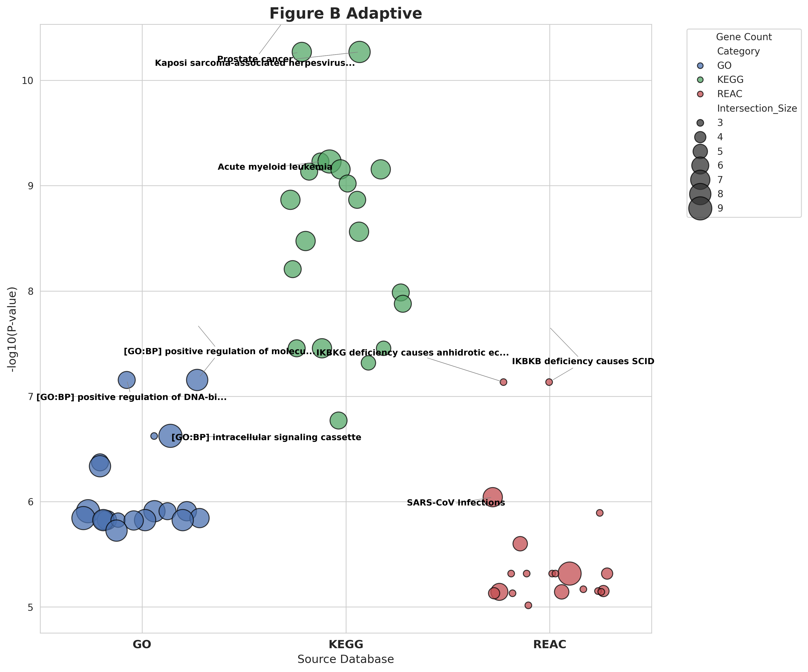
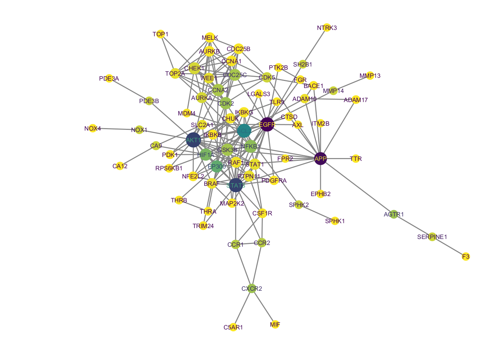

# netpharmpy

[](https://www.python.org/downloads/)
[](https://opensource.org/licenses/MIT)
[](https://doi.org/10.5281/zenodo.18074031)


**Network pharmacology pipeline for drug discovery and target prediction.** Integrates Reactome pathway analysis, STRING protein-protein interaction networks, and multi-omics enrichment (GO/KEGG/Reactome). User-friendly Python framework for computational biologists with guided workflows and publication-ready outputs.


[]

[]

---

## 📋 Table of Contents

- [Overview](#overview)
- [Features](#features)
- [Installation](#installation)
- [Quick Start](#quick-start)
- [Usage](#usage)
  - [Interactive Mode](#interactive-mode)
  - [Configuration File](#configuration-file)
  - [Python API](#python-api)
- [Pipeline Steps](#pipeline-steps)
- [Output Structure](#output-structure)
- [Examples](#examples)
- [Documentation](#documentation)
- [Citation](#citation)
- [Credits & References](#credits--references)
- [Contributing](#contributing)
- [License](#license)
- [Contact](#contact)

---

## Overview

**netpharmpy** is a comprehensive Python toolkit for network pharmacology analysis, designed to facilitate drug discovery and target prediction research. It automates the workflow described in recent network pharmacology studies, providing a reproducible and user-friendly pipeline for:

- **Target Prediction**: Identifying potential protein targets for small molecules
- **Pathway Analysis**: Mapping targets to biological pathways
- **Network Construction**: Building protein-protein interaction networks
- **Functional Enrichment**: Discovering biological significance

**Key Applications:**
- Drug repurposing studies
- Natural product pharmacology
- Mechanism of action elucidation
- Multi-target drug discovery
- Systems pharmacology research

**Inspired by:** Limsakul et al. (2025) - [Immunomodulatory Effects of Curcumin on CAR T-Cell Therapy](https://doi.org/10.3390/antiox14040454)

### Motivation and design rationale

Pharmacological effects often emerge from interactions across complex biological networks rather than from modulation of single molecular targets. While numerous databases and tools exist for drug–target and protein–protein interaction analysis, many available solutions are tightly coupled to specific data sources, impose rigid analytical pipelines, or obscure intermediate computational steps.

netpharmpy was developed to address these limitations by offering a **minimal and extensible software layer** that allows researchers to:

1. Represent pharmacological data explicitly as networks,
2. Apply graph-based analyses using familiar Python workflows, and
3. Integrate custom data sources and downstream analyses without vendor or database lock-in.

The software prioritizes methodological clarity over automation and is intentionally agnostic to specific biological interpretations or predictive claims.

### Core functionality

At its core, netpharmpy provides utilities for:
- Constructing network representations of drug–target interactions and related biological relationships
- Manipulating and querying these networks using graph-based abstractions
- Performing basic network analyses suitable for exploratory systems pharmacology research

The package is designed to interoperate seamlessly with the broader scientific Python ecosystem, allowing users to extend analyses using external libraries for statistics, visualization, or downstream biological interpretation.

### Intended use cases

netpharmpy is suitable for a range of research-oriented applications, including:
- Exploratory analysis of drug–target interaction networks
- Investigation of polypharmacology and multi-target drug effects
- Integration of pharmacological data with protein–protein interaction networks
- Identification of subnetworks or pathways potentially perturbed by drug intervention
- Rapid prototyping of network pharmacology workflows prior to large-scale or production-level analyses

The software is intended for use by computational biologists, bioinformaticians, and systems pharmacology researchers with basic familiarity in Python programming.

---

## Features

- ✅ **Automated Pipeline**: Five-step workflow from compound to network visualization
- ✅ **Multi-Database Integration**: SwissTargetPrediction, SuperPred, Reactome, STRING, g:Profiler
- ✅ **Reproducible Research**: Configuration files and detailed logging
- ✅ **Publication-Ready Outputs**: High-quality network visualizations (PNG, HTML)
- ✅ **User-Friendly**: Interactive prompts and clear instructions
- ✅ **Flexible**: Command-line and Python API access
- ✅ **Well-Documented**: Comprehensive examples and tutorials

---

## 📦 Installation

### Prerequisites

- Python 3.8 or higher
- Internet connection (for API access)

### Using pip (coming soon)

```
pip install netpharmpy
```

### From Source

```
# Clone the repository
git clone https://github.com/axp-knickei/netpharmpy.git
cd netpharmpy

# Create virtual environment (recommended)
python -m venv venv
source venv/bin/activate  # On Windows: venv\Scripts\activate

# Install dependencies
pip install -r requirements.txt

# Install in editable mode
pip install -e .
```

### Using uv (faster alternative)

```
git clone https://github.com/axp-knickei/netpharmpy.git
cd netpharmpy

# Create and activate environment
uv venv
source .venv/bin/activate

# Install dependencies
uv pip install -r requirements.txt

# Install package
uv pip install -e .
```

---

## Quick Start

### Simple Example

```
from netpharm import NetworkPharmacology

# Initialize with curcumin (PubChem CID: 969516)
npharma = NetworkPharmacology(cid=969516)

# Run complete analysis
npharma.run_full_pipeline()
```

### Command Line

```
# Interactive mode
python main.py

# With configuration file
python main.py --config examples/config_example.yaml
```

---

## Usage

### Interactive Mode

The simplest way to use netpharmpy - the tool will guide you through each step:

```
python main.py
```

You'll be prompted for:
- Compound input (CID or SMILES)
- Target prediction thresholds
- Pathway keywords or IDs
- Network parameters
- Enrichment method

### Configuration File

For reproducible research, use a YAML configuration file:

```
# config.yaml
compound:
  cid: 969516  # Curcumin

target_prediction:
  swiss_threshold: 0.0
  superpred_threshold: 0.5

pathways:
  search_terms:
    - "R-HSA-1280218"  # Adaptive Immune System
    - "R-HSA-1280215"  # Cytokine Signaling

string:
  confidence: 0.700

enrichment:
  method: "gprofiler"  # or "david"

output:
  directory: "./results"
```

Run with:

```
python main.py --config config.yaml
```

### Python API

For integration into your own scripts:

```
from netpharm import NetworkPharmacology

# Initialize
npharma = NetworkPharmacology(
    cid=969516,
    output_base='./my_analysis'
)

# Step-by-step execution
npharma.get_compound_info()
npharma.predict_targets(swiss_threshold=0.0, superpred_threshold=0.5)
npharma.analyze_pathways(['R-HSA-1280218', 'R-HSA-1280215'])
npharma.build_network(confidence=0.700)
npharma.enrichment_analysis(method='gprofiler')
```
---
## How to Read This Pipeline

This pipeline is organized as a sequence of steps, but **each step serves a different purpose and uses a different type of reasoning**. The steps are **complementary**, not repetitive.

In simple terms:

* **Steps 1–2** gather *possible targets* for a compound.
* **Step 3** applies **biological reasoning** to filter those targets to a relevant biological system (e.g., immune signaling).
* **Step 4** provides **network context**, showing how the selected proteins interact as a system.
* **Step 5** applies **statistical analysis** to describe which biological functions are over-represented in that system.

Importantly:

* **Step 3 is not a statistical test** — it is a biologically informed filtering step.
* **Step 4 does not identify drug targets** — it describes system structure and connectivity.
* **Step 5 does not validate mechanisms** — it statistically summarizes functional themes.

These steps are intentionally separated to avoid conflating **mechanistic reasoning**, **network context**, and **statistical interpretation**. Together, they support **transparent and reproducible hypothesis generation**, not causal inference.

---

## Pipeline Steps

### Step 1: Compound Information Retrieval

Retrieves molecular properties from PubChem:
- Canonical SMILES
- Molecular formula and weight
- IUPAC name

**Database:** [PubChem](https://pubchem.ncbi.nlm.nih.gov/)

### Step 2: Target Prediction

Predicts potential protein targets using:
- **SwissTargetPrediction**: Similarity-based predictions
- **SuperPred**: Known strong binders + predicted targets

**Manual workflow** with clear instructions for downloading results.

### 🔍 Understanding the Role of Steps 3, 4, and 5

Although Steps 3, 4, and 5 are executed sequentially, they serve **different conceptual purposes** and answer **different biological questions**. They should not be interpreted as redundant analyses.

**In simple terms:**

* **Step 3 answers *“Which targets are biologically relevant?”***
* **Step 4 answers *“How do these targets behave as a system?”***
* **Step 5 answers *“What biological functions are over-represented?”***

Each step represents a **different type of reasoning**, as summarized below.

| Step                               | Type of reasoning                  | Purpose                                                                                                                                                                                                                           |
| ---------------------------------- | ---------------------------------- | --------------------------------------------------------------------------------------------------------------------------------------------------------------------------------------------------------------------------------- |
| **Step 3 – Pathway Analysis**      | Biological / mechanistic filtering | Restricts predicted targets to those involved in user-selected biological pathways (e.g., immune signaling). This step reduces noise and focuses the analysis on biologically plausible mechanisms.                               |
| **Step 4 – Network Analysis**      | Systems-level context              | Examines how the selected proteins interact with each other using protein–protein interaction networks. This step identifies highly connected proteins (network hubs) and reveals system structure, not statistical significance. |
| **Step 5 – Functional Enrichment** | Statistical interpretation         | Tests whether specific biological functions or pathways are over-represented in the selected gene set compared to a background. This step provides statistical support for functional themes.                                     |

Importantly:

* **Step 3 is not a statistical test** — it is a biologically informed filtering step.
* **Step 4 does not identify drug targets** — it provides network context.
* **Step 5 does not validate mechanisms** — it highlights statistically enriched functional annotations.

Together, these steps support **hypothesis generation**, not causal inference.

### Step 3: Pathway Analysis (Biological Filtering)

Uses curated biological pathways to filter predicted targets to those relevant to the biological system of interest:
- Searches user-defined Reactome pathways
- Extracts all proteins involved in those pathways
- Retains only predicted targets that overlap with pathway proteins


**Database:** [Reactome](https://reactome.org/) (used as a source of curated biological pathway knowledge)


### Step 4: Network Construction

Builds protein-protein interaction networks:
- Queries STRING database
- Analyzes network topology
- Identifies hub proteins
- Creates three visualization types:
  - Basic (publication-ready PNG)
  - Colored (degree-based)
  - Interactive (HTML)

**Database:** [STRING](https://string-db.org/)

### Step 5: Functional Enrichment (Statistical Interpretation)

Performs statistical enrichment analysis on biologically filtered targets:
- Gene Ontology (Biological Process, Molecular Function, Cellular Component)
- KEGG pathway annotations
- Reactome pathway annotations

**Tools:** [g:Profiler](https://biit.cs.ut.ee/gprofiler/) or [DAVID](https://david.ncifcrf.gov/) (used for over-representation analysis)

The pipeline intentionally separates biological filtering (Step 3), network context (Step 4), and statistical interpretation (Step 5). Step 3 determines biological relevance using curated pathway knowledge, while Step 5 statistically describes functional patterns within that biologically constrained gene set. This separation avoids conflating mechanistic reasoning with statistical enrichment.


---

## 📂 Output Structure

```
outputs/
└── compound_969516_20251213_123456/
    ├── step1_compound_info/
    │   └── compound_info.csv
    ├── step2_targets/
    │   ├── swiss_targets.csv
    │   └── superpred_targets.csv
    ├── step3_pathways/
    │   ├── pathways_searched.csv
    │   ├── pathway_proteins.csv
    │   └── overlapping_targets.csv
    ├── step4_network/
    │   ├── string_interactions.csv
    │   ├── network_metrics.csv
    │   ├── network_basic.png
    │   ├── network_colored.png
    │   └── network_interactive.html
    ├── step5_enrichment/
    │   ├── gprofiler_all_results.csv
    │   ├── gprofiler_go_bp.csv
    │   ├── gprofiler_kegg.csv
    │   └── gprofiler_reac.csv
    └── 969516_20251213_123456.log
```

---

## 📚 Examples

### Curcumin Analysis (Replicating Published Study)

```
python examples/curcumin_example.py
```

This example replicates the analysis from:
> Limsakul, P., et al. (2025). Immunomodulatory Effects of Curcumin on CAR T-Cell Therapy. *Antioxidants*, 14(4), 454.

### Custom Compound Analysis

```
from netpharm import NetworkPharmacology

# Example: Resveratrol (CID: 445154)
npharma = NetworkPharmacology(cid=445154)
npharma.run_full_pipeline()
```

### Batch Analysis (Coming in v2.0)

Feature planned for future release.

---

## Documentation

- **Installation Guide**: See [Installation](#installation)
- **Tutorial**: See [examples/curcumin_example.py](examples/curcumin_example.py)
- **API Reference**: Coming soon
- **Troubleshooting**: Check [Issues](https://github.com/axp-knickei/netpharmpy/issues)

---

## Citation

If you use netpharmpy in your research, please cite:

```
@software{netpharmpy2025,
  author = {Alex Prima},
  title = {netpharmpy: Network Pharmacology Pipeline for Drug Discovery},
  year = {2025},
  url = {https://github.com/axp-knickei/netpharmpy},
  version = {0.1.0},
  doi={doi.org/10.5281/zenodo.18074031}
}
```

### Citing the Methodology

This tool implements the methodology described in:

```
@article{limsakul2025immunomodulatory,
  title={Immunomodulatory Effects of Curcumin on CAR T-Cell Therapy},
  author={Limsakul, Praopim and Srifa, Pemikar and Huang, Ziliang and Zhu, Linshan and Wu, Yiqian and Charupanit, Krit},
  journal={Antioxidants},
  volume={14},
  number={4},
  pages={454},
  year={2025},
  publisher={MDPI},
  doi={10.3390/antiox14040454}
}
```

---

## Credits & References

### External Tools & Databases

netpharmpy integrates the following resources:

#### Chemical & Compound Databases
- **PubChem** - Kim, S., et al. (2023). PubChem 2023 update. *Nucleic Acids Research*, 51(D1), D1373-D1380. [https://pubchem.ncbi.nlm.nih.gov/](https://pubchem.ncbi.nlm.nih.gov/)

#### Target Prediction
- **SwissTargetPrediction** - Daina, A., Michielin, O., & Zoete, V. (2019). SwissTargetPrediction: updated data and new features. *Nucleic Acids Research*, 47(W1), W357-W364. [http://www.swisstargetprediction.ch/](http://www.swisstargetprediction.ch/)

- **SuperPred** - Nickel, J., et al. (2014). SuperPred: update on drug classification and target prediction. *Nucleic Acids Research*, 42(W1), W26-W31. [https://prediction.charite.de/](https://prediction.charite.de/)

#### Pathway Databases
- **Reactome** - Milacic, M., et al. (2024). The Reactome Pathway Knowledgebase 2024. *Nucleic Acids Research*, 52(D1), D672-D678. [https://reactome.org/](https://reactome.org/)

#### Protein-Protein Interactions
- **STRING** - Szklarczyk, D., et al. (2023). The STRING database in 2023: protein-protein association networks. *Nucleic Acids Research*, 51(D1), D638-D646. [https://string-db.org/](https://string-db.org/)

#### Functional Enrichment
- **g:Profiler** - Kolberg, L., et al. (2023). g:Profiler—interoperable web service for functional enrichment analysis. *Nucleic Acids Research*, 51(W1), W207-W212. [https://biit.cs.ut.ee/gprofiler/](https://biit.cs.ut.ee/gprofiler/)

- **DAVID** - Sherman, B.T., et al. (2022). DAVID: a web server for functional enrichment analysis. *Nucleic Acids Research*, 50(W1), W216-W221. [https://david.ncifcrf.gov/](https://david.ncifcrf.gov/)

### Python Libraries

- **PubChemPy** - [https://github.com/mcs07/PubChemPy](https://github.com/mcs07/PubChemPy)
- **NetworkX** - Hagberg, A.A., et al. (2008). NetworkX [Software]. [https://networkx.org/](https://networkx.org/)
- **pandas** - McKinney, W. (2010). Data Structures for Statistical Computing in Python. [https://pandas.pydata.org/](https://pandas.pydata.org/)
- **matplotlib** - Hunter, J.D. (2007). Matplotlib: A 2D graphics environment. [https://matplotlib.org/](https://matplotlib.org/)
- **PyVis** - [https://github.com/WestHealth/pyvis](https://github.com/WestHealth/pyvis)

---

## Contributing

Contributions are welcome! Please feel free to submit a Pull Request. For major changes, please open an issue first to discuss what you would like to change.

### Development Setup

```
git clone https://github.com/axp-knickei/netpharmpy.git
cd netpharmpy
pip install -e ".[dev]"
pytest tests/
```

### Contribution Guidelines

- Follow PEP 8 style guidelines
- Add tests for new features
- Update documentation as needed
- Ensure all tests pass before submitting PR

---

## 📄 License

This project is licensed under the MIT License - see the [LICENSE](LICENSE) file for details.

---

## 📧 Contact

- **Author**: Alex Prima
- **Email**: [alex.prima@uq.net.au](mailto:alex.prima@uq.net.au)
- **GitHub**: [@axp-knickei](https://github.com/axp-knickei)
- **Issues**: [https://github.com/axp-knickei/netpharmpy/issues](https://github.com/axp-knickei/netpharmpy/issues)

---

## Acknowledgments

- Inspired by the methodology of Limsakul et al. (2025)
- Thanks to all the database and tool maintainers cited above
- Built with support from the bioinformatics community

---

## 📊 Project Status


[](https://doi.org/10.5281/zenodo.18074031)

### Current Version: 0.1.0

**Release Date:** December 2025

### Features

- ✅ Target prediction (SwissTargetPrediction + SuperPred)
- ✅ Pathway analysis (Reactome)
- ✅ Network construction (STRING)
- ✅ Enrichment analysis (g:Profiler + DAVID)
- ✅ Multiple visualization formats
- ✅ Configuration file support
- ✅ Logging system
- ✅ Basic unit tests

### Roadmap

#### v1.1.0
- [ ] Backup pathway data for offline analysis
- [ ] Enhanced error recovery
- [ ] Additional visualization options
- [ ] Docker container support

### Known Issues

netpharmpy is currently released as early-stage research software. Known limitations include:

- APIs may evolve as the project matures
- Reactome API may occasionally be unavailable (temporary server issues)
- Manual downloads required for SwissTargetPrediction and SuperPred
- Documentation and tutorials are intentionally minimal but under active development
- Performance has not yet been optimized for very large-scale networks
- Large networks (>100 proteins) may take longer to visualize
- The package does not provide built-in visualization or clinical interpretation modules

Biological interpretation of results remains the responsibility of the user, and netpharmpy does not aim to provide clinical or predictive decision support.

Report bugs or request features: [GitHub Issues](https://github.com/axp-knickei/netpharmpy/issues)

---

## 📈 Statistics


---

*Last updated: December 28, 2025*
